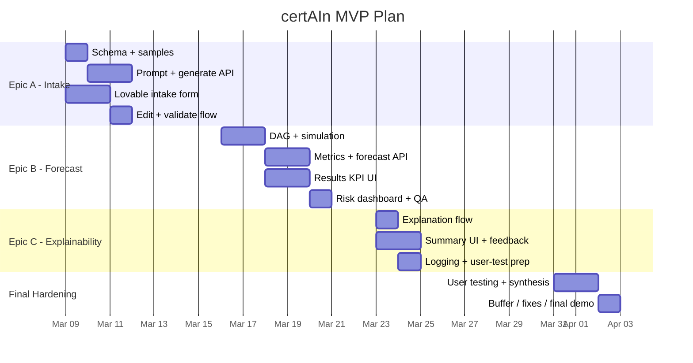

# 05 - User Stories and Task Mapping

## Outcome Goal
In 3.5 weeks, project managers, PMO leads, and technical founders will be able to turn a project brief into an explainable delay-risk forecast, resulting in at least `60%` of test users saying the tool improved their confidence in timeline decisions. In the same period, the team will learn to ship a measurable AI-plus-simulation MVP from Lovable frontend to FastAPI backend.

## Team Ownership
- Mey - Backend / AI / Simulation
- Santiago - Frontend / PM / UX / Research

## Epic A - Guided Intake and Editable Task Plan
Purpose: help users get from project brief to a clean, reviewable project plan with minimal friction.

### User Stories
1. As a project manager, I want to paste a short project brief and receive a draft task plan so that I do not have to create the entire dependency structure manually.
- Acceptance criteria: user submits brief -> API returns task JSON -> editable task table renders with no missing required fields.
2. As a user, I want to edit tasks, durations, and dependencies before forecasting so that I can trust the input going into the model.
- Acceptance criteria: user can change rows in the task table -> validation catches cycles or missing references -> corrected plan can be saved locally.

### Deliverables
- Brief intake form
- AI generation prompt
- `/api/intake/generate` and `/api/intake/validate`
- Editable task-plan table
- One sample-project fallback

### Tasks

| Level | Description | Owner | Est. Effort | Component / API | Input -> Output / Success Condition | Dependencies | Acceptance Criteria |
|-------|-------------|-------|-------------|-----------------|-------------------------------------|--------------|--------------------|
| Task | Define task-plan schema and sample payload contract | Mey | 0.5 day | `backend/schemas/task_plan.py` | Task fields and validation rules are documented in code and sample JSON | None | Schema supports `id`, `name`, `duration`, `dependencies`, `risk_factor`, and target date assumptions |
| Task | Write project-brief -> task-plan prompt and test on 3 sample briefs | Mey| 0.5 day | `backend/prompts/generate_plan.txt` | Three sample briefs produce structured JSON with <=12 tasks | Task schema | Prompt output passes manual review on 2 of 3 test briefs |
| Task | Build `/api/intake/generate` endpoint with sample-project fallback | Mey | 1 day | `backend/api/intake.py`, `backend/data/sample_projects/*.json` | POST brief -> returns draft task JSON or sample fallback | Prompt, schema | Endpoint returns `200` with valid JSON or a clean fallback payload |
| Task | Build `/api/intake/validate` endpoint | Mey | 0.5 day | `backend/api/validate.py` | Edited plan -> validation result with field-level errors | Schema | Cycles, missing dependencies, and invalid durations are caught before forecast run |
| Task | Create Lovable intake screen with brief, deadline, and team-size inputs | Santiago | 1 day | `frontend/pages/Intake` | User can enter required fields and submit to API | None | Form validates required inputs and shows loading/error states |
| Task | Build editable task table for generated plan review | Santiago | 1 day | `frontend/components/TaskTable` | Generated rows become editable rows with add/remove/edit actions | Intake screen, schema | User can change duration and dependency fields without losing state |
| Task | Connect intake flow -> generate -> edit -> validate | Santiago | 0.5 day | `frontend/services/api.ts` | Frontend can complete the full intake loop without manual refresh | Generate and validate endpoints, task table | Validation errors display inline and corrected rows can be resubmitted |

## Epic B - Forecast Engine and Risk Metrics
Purpose: turn a validated task plan into decision-ready schedule-risk metrics.

### User Stories
1. As a PM, I want to know the probability of missing my deadline so that I can judge whether the current plan is safe.
- Acceptance criteria: forecast returns delay probability, mean, P50, and P80 for the selected deadline.
2. As a PMO lead, I want to see which tasks drive risk so that I can intervene early.
- Acceptance criteria: results include top risk drivers ranked by critical-path frequency or impact.

### Deliverables
- DAG builder and cycle check
- Monte Carlo simulation service
- `/api/forecast/run`
- KPI cards
- Risk distribution and top-driver view

### Tasks

| Level | Description | Owner | Est. Effort | Component / API | Input -> Output / Success Condition | Dependencies | Acceptance Criteria |
|-------|-------------|-------|-------------|-----------------|-------------------------------------|--------------|--------------------|
| Task | Implement DAG builder and cycle detection | Mey | 1 day | `backend/services/graph.py` | Valid task plan -> acyclic graph object or clear error | Epic A schema | Cyclic plans are rejected with readable error text |
| Task | Implement Monte Carlo duration sampling service | Mey | 1 day | `backend/services/simulation.py` | Graph + durations -> array of simulated completion times | Graph builder | Service runs deterministic tests with fixed seed |
| Task | Compute mean, P50, P80, delay probability, and top risk drivers | Mey | 1 day | `backend/services/metrics.py` | Simulation output -> metrics JSON and ranked driver list | Simulation service | Metrics are returned for sample plan and top 3 drivers are populated |
| Task | Build `/api/forecast/run` endpoint and response contract | Mey | 1 day | `backend/api/forecast.py` | Validated plan -> forecast response payload | Graph, simulation, metrics | Endpoint handles happy path and invalid input path cleanly |
| Task | Create results KPI cards and deadline selector in Lovable | Santiago | 1 day | `frontend/pages/Results` | User sees delay probability, P50, P80 after run | Forecast endpoint | KPI cards load from live API data without manual refresh |
| Task | Add distribution chart, top-driver ranking, and end-to-end QA on 2 sample projects | Santiago | 1 day | `frontend/components/RiskDashboard`, `qa/forecast-checklist.md` | Metrics payload renders correctly and both sample projects complete the flow | Results page | Chart and driver list update on rerun and QA checklist records no blocker defects |

## Epic C - Explainable Results and Feedback Loop
Purpose: make the forecast defensible in stakeholder conversations and measure whether it improves decision confidence.

### User Stories
1. As a project manager, I want a plain-language explanation of the forecast so that I can explain risk in a VP or investor meeting.
- Acceptance criteria: summary references delay probability, deadline risk, and top drivers in natural language.
2. As the product team, we want lightweight confidence and trust feedback so that we can validate the MVP hypothesis.
- Acceptance criteria: confidence-before/after and trust responses are captured and stored with the session.

### Deliverables
- Explanation prompt or template
- Forecast explanation response
- Executive summary panel
- Methodology and assumptions note
- Copy-ready text action
- Confidence and trust survey
- Event logging and KPI readout

### Tasks

| Level | Description | Owner | Est. Effort | Component / API | Input -> Output / Success Condition | Dependencies | Acceptance Criteria |
|-------|-------------|-------|-------------|-----------------|-------------------------------------|--------------|--------------------|
| Task | Design grounded explanation prompt or template using only forecast JSON fields | Mey | 0.5 day | `backend/prompts/explain_forecast.txt` or `backend/services/explainer.py` | Forecast JSON -> summary, top risks, mitigation suggestions | Forecast response contract | Summary references only returned metrics and drivers |
| Task | Append explanation to the forecast flow | Mey | 0.5 day | `backend/api/forecast.py` | Forecast payload -> forecast plus explanation payload | Prompt or template, forecast endpoint | Main forecast response includes summary, 3 risk bullets, and 3 mitigation bullets |
| Task | Build summary panel and copy-ready text action in Lovable | Santiago | 1 day | `frontend/components/ExecutiveSummary` | Explanation payload -> readable card layout and copy action | Forecast response with explanation | User can copy a clean summary in one action |
| Task | Add methodology note plus confidence-before/after and trust survey | Santiago | 0.5 day | `frontend/components/MethodologyNote`, `frontend/components/FeedbackPanel` | User can understand metrics and submit 2-3 responses after results | Results page | Definitions are visible and survey submits without blocking the main flow |
| Task | Log key events and feedback to Google Sheets or SQLite | Mey | 0.5 day | `backend/services/analytics_store.py`, `backend/api/feedback.py` | Event and survey payload -> stored record | Feedback UI | Test records appear in storage with correct schema |
| Task | Run 5-6 user test sessions, create KPI readout, and synthesize top findings | Santiago | 1 day | `docs/mvp-test-synthesis.md`, Google Sheet or Notion dashboard | Notes and metrics -> decision-ready synthesis | End-to-end MVP | Report lists confidence lift, rerun behavior, and top blockers |

## Optional Learning Goals by Member
- Mey: improve prompt robustness, endpoint design, simulation reliability, and lightweight analytics plumbing
- Santiago: improve Lovable handoff, user-testing practice, metric storytelling, and roadmap decision-making

## Suggested 3.5-Week Execution Sequence
1. Week 1: Epic A
2. Week 2: Epic B
3. Week 3: Epic C
4. Week 3.5: QA, usability tests, and fixes

## Bonus - Mermaid Gantt

