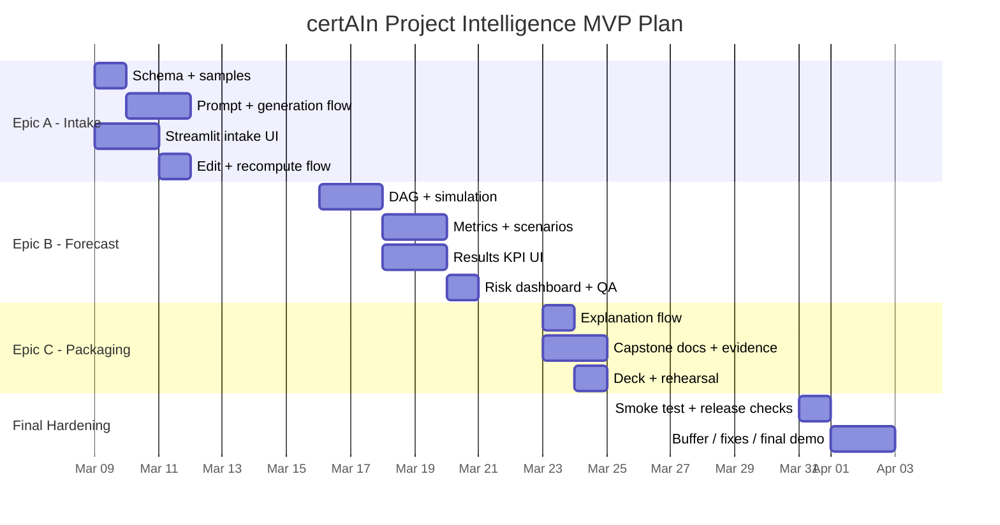

# 05 - User Stories and Task Mapping

## Outcome Goal
In 3.5 weeks, project managers, PMO leads, and technical founders will be able to turn a project brief into an explainable delay-risk forecast. In the same period, the team will learn to ship a measurable AI-plus-simulation MVP from Streamlit intake to validated forecasting, explanation, and export.

## Team Ownership
- Person A - Platform / AI / Simulation
- Person B - Streamlit / PM / UX / Research

## Epic A - Guided Intake and Editable Task Plan
Purpose: help users get from project brief to a clean, reviewable project plan with minimal friction.

### User Stories
1. As a project manager, I want to paste a short project brief and receive a draft task plan so that I do not have to create the entire dependency structure manually.
   Acceptance criteria: user submits brief -> valid task JSON is generated -> editable task table renders with no missing required fields.
2. As a user, I want to edit tasks, durations, and dependencies before forecasting so that I can trust the input going into the model.
   Acceptance criteria: user can change rows in the task table -> validation catches cycles or missing references -> corrected plan can be re-run locally.

### Deliverables
- Streamlit brief intake form
- AI generation prompt
- Schema validation
- Editable task-plan table
- One sample-project fallback

### Tasks

| Level | Description | Owner | Est. Effort | Component | Input -> Output / Success Condition | Dependencies | Acceptance Criteria |
|-------|-------------|-------|-------------|-----------|-------------------------------------|--------------|--------------------|
| Task | Define task-plan schema and sample payload contract | Person A | 0.5 day | `src/ai/schema.py` | Task fields and validation rules are documented in code and sample JSON | None | Schema supports `id`, `name`, `mean_duration`, `std_dev`, `dependencies`, and `risk_factor` |
| Task | Write project-brief -> task-plan prompt and test on 3 sample briefs | Person A | 0.5 day | `src/ai/prompt.py` | Three sample briefs produce structured JSON with <=12 tasks | Task schema | Prompt output passes manual review on 2 of 3 test briefs |
| Task | Build generation flow with sample-project fallback | Person A | 1 day | `src/ai/task_generator.py`, `src/ai/mock_data.py` | Project text -> draft task JSON or sample fallback | Prompt, schema | Returned payload validates cleanly in both `real` and `mock` modes |
| Task | Add brief intake inputs in Streamlit | Person B | 1 day | `app.py` sidebar | User can enter required fields and submit a run | None | Inputs validate and show loading or error states clearly |
| Task | Build editable task table for generated plan review | Person B | 1 day | `app.py` task editor | Generated rows become editable rows with add or edit actions | Intake flow, schema | User can change duration and dependency fields without losing state |
| Task | Connect intake flow -> generate -> edit -> recompute | Person B | 0.5 day | `app.py` | App completes the full intake loop without manual refresh | Generation flow, task table | Validation errors display clearly and corrected rows can be resubmitted |

## Epic B - Forecast Engine and Risk Metrics
Purpose: turn a validated task plan into decision-ready schedule-risk metrics.

### User Stories
1. As a PM, I want to know the probability of missing my deadline so that I can judge whether the current plan is safe.
   Acceptance criteria: forecast returns delay probability, mean, P50, and P80 for the selected deadline.
2. As a PMO lead, I want to see which tasks drive risk so that I can intervene early.
   Acceptance criteria: results include top risk drivers ranked by critical-path frequency.

### Deliverables
- DAG builder and cycle check
- Monte Carlo simulation service
- KPI cards
- Risk distribution and top-driver view
- Scenario comparison

### Tasks

| Level | Description | Owner | Est. Effort | Component | Input -> Output / Success Condition | Dependencies | Acceptance Criteria |
|-------|-------------|-------|-------------|-----------|-------------------------------------|--------------|--------------------|
| Task | Implement DAG builder and cycle detection | Person A | 1 day | `src/modeling/graph_builder.py` | Valid task plan -> acyclic graph object or clear error | Epic A schema | Cyclic plans are rejected with readable error text |
| Task | Implement critical path and Monte Carlo duration sampling | Person A | 1 day | `src/modeling/critical_path.py`, `src/simulation/monte_carlo.py` | Graph + durations -> critical path and simulated completion times | Graph builder | Service runs deterministic tests with fixed seed |
| Task | Compute mean, P50, P80, delay probability, and top risk drivers | Person A | 1 day | `src/analytics/metrics.py`, `src/analytics/risk_drivers.py` | Simulation output -> metrics and ranked driver list | Simulation service | Metrics are returned for sample plan and top 3 drivers are populated |
| Task | Build scenario comparison logic | Person A | 1 day | `src/analytics/scenarios.py` | Validated plan -> scenario comparison dataframe | Graph, simulation, metrics | Baseline, aggressive deadline, and increased capacity are comparable in one table |
| Task | Create results KPI cards and deadline selector in Streamlit | Person B | 1 day | `app.py` Executive Brief | User sees delay probability, P50, and P80 after run | Forecast modules | KPI cards load from live analysis data without manual refresh |
| Task | Add distribution chart, top-driver ranking, and end-to-end QA on 2 sample projects | Person B | 1 day | `src/visualization/charts.py`, `app.py`, `RELEASE_CHECKLIST.md` | Metrics payload renders correctly and both sample projects complete the flow | Results page | Chart and driver list update on rerun and QA checklist records no blocker defects |

## Epic C - Explainable Results and Capstone Evidence
Purpose: make the forecast defensible in stakeholder conversations and package the project for review.

### User Stories
1. As a project manager, I want a plain-language explanation of the forecast so that I can explain risk in a VP or investor meeting.
   Acceptance criteria: summary references delay probability, deadline risk, and top drivers in natural language.
2. As a reviewer, I want to see the business framing, EDA, and model comparison in the repo so that I can assess whether the project satisfies the capstone requirements.
   Acceptance criteria: the repository contains a clear business-question doc, an EDA summary, a model comparison report, and the final presentation.

### Deliverables
- Forecast explanation template
- Executive summary panel
- Methodology note
- EDA summary and model comparison report
- Final deck, evidence pack, and Q&A assets
- Validation-readout template

### Tasks

| Level | Description | Owner | Est. Effort | Component | Input -> Output / Success Condition | Dependencies | Acceptance Criteria |
|-------|-------------|-------|-------------|-----------|-------------------------------------|--------------|--------------------|
| Task | Design grounded executive summary text using only forecast fields | Person A | 0.5 day | `app.py` | Forecast metrics -> plain-language summary | Forecast output contract | Summary references only returned metrics and drivers |
| Task | Train and compare multiple advisory ML models | Person A | 0.5 day | `scripts/train_risk_model.py`, `models/risk_model_metrics.json` | Training dataset -> benchmarked candidate models and saved best model | Dataset, feature schema | Repo shows more than one model family and a clear selection rule |
| Task | Build summary panel and copy-ready evidence in the app | Person B | 1 day | `app.py` Executive Brief and Export | Summary payload -> readable card layout and export actions | Forecast output | User can copy a clean summary in one action |
| Task | Package business questions, EDA, and deliverables map | Person B | 0.5 day | `docs/` | Core evidence -> coach-readable capstone docs | Stable app and model metrics | Reviewer can verify required deliverables without opening code first |
| Task | Update final presentation, evidence pack, and Q&A assets | Person B | 0.5 day | `presentation/` | Repository evidence -> final presentation package | Docs, app, model metrics | Deck, evidence pack, and Q&A all reflect the implemented Streamlit product |
| Task | Prepare internal validation notes and external session template | Person B | 0.5 day | `docs/mvp-test-synthesis.md` | Internal rehearsal findings -> ready-to-run session log and KPI readout | Demo flow | No fake user research is claimed and the test kit is ready for follow-up sessions |

## Optional Learning Goals by Member
- Person A: improve prompt robustness, simulation reliability, model benchmarking, and lightweight persistence
- Person B: improve Streamlit product storytelling, evidence packaging, and stakeholder-focused presentation

## Suggested 3.5-Week Execution Sequence
1. Week 1: Epic A
2. Week 2: Epic B
3. Week 3: Epic C
4. Week 3.5: QA, rehearsal, and final packaging

## Bonus - Mermaid Gantt

